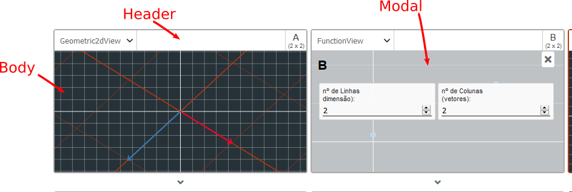

# Índice
* [Estrutura Básica](#estrutura-básica)
  * [Modelo padrão de uma visualização](#modelo-padrão-de-uma-visualização)
  * [A classe View](#a-classe-view)
  * [Importando bibliotecas externas](#importando-bibliotecas-externas)
  * [Recursos Herdados](#recursos-herdados)
      * [Propriedades Herdadas](#propriedades-herdadas)
      * [Métodos Herdados](#métodos-herdados)
* [Criei minha visualização, e agora?](#criei-minha-visualização-e-agora)
* [Recursos](#recursos)
  * [Bibliotecas](#bibliotecas)
  * [Helpers](#helpers)

# Estrutura Básica

As visualizações possuem uma pasta correta para sua localização. esta pasta é [/scripts/views](/script/views).

Se sua visualização precisar de mais de um arquivo para funcionar (como html's ou css's), crie uma pasta com o nome de sua visualização e dentro crie um arquivo javascript com o mesmo nome. 

Se sua visualização precisar de apenas um arquivo para funcionar, apenas crie um arquivo javascript com o nome de sua visualização.

Este javascript criado será sua **classe de visualização**. Nele que todas as funcionalidades de sua visualização serão inseridas.

## Modelo padrão de uma visualização

As visualizações são partes cruciais do projeto. Elas são a cara do que se quer ver no webapp e por isso precisam de um certo cuidado ao serem criadas. Por isso existe uma forma correta de construí-las.
Abaixo você pode ver um exemplo de classe de visualização. Observe que a classe estende uma outra classe chamada View (falaremos sobre a classe View depois).
Todas as visualizações recebem muitos dados de parâmetros e estes dados devem ser repassados para a View, por isso no construtor de sua classe você deve, antes de qualquer outro comando, inserir o comando ``super(params)``, sendo *"params"* o parâmetro do construtor.

```javascript
class ExampleView extends View{
  constructor(params){
    super(params);
  }

}

//Ao final do seu arquivo, você deve adicionar o método define.
define(()=>ExampleView);
```

Para que sua classe seja devidamente reconhecida pelo sistema, é necessário que você coloque ao final do seu arquivo o comando define recebendo como parâmetro um callback que retorne **sua classe** (como exemplificado acima);


## A classe View

A classe view é uma classe que serve para o sistema fazer o "dirty work" das visualizações. Ela inicializa objetos e propriedades que serão de extrema importância para serem usados por sua visualização. Todos os dados que o sistema passa através do parâmetro no construtor de sua classe são manipulados e refinados pela classe view para que fiquem utilizáveis pela visualização que você pretende construir, por isso é importante chamar a diretiva super passando o parâmetro do seu construtor.

### Importando bibliotecas externas

### Recursos Herdados
A partir da classe view o desenvolvedor de visualizações tem acesso a uma série de propriedades e métodos do sistema que serão úteis para o desenvolvimento.

#### Propriedades Herdadas
São dados do sistema que informam coisas importantes, como os nomes das matrizes usadas na célula, os valores das matrizes, etc. Abaixo estão listados todas estas propriedades.

***_matrixNames***:  
Array com nomes das matrizes (A, B, C ...) que serão representadas pela visualização. Isto é calculado baseado na posição inicial da célula somado ao tamanho horizontal(colspan) dela.

Você pode acessar esta propriedades em qualquer parte da sua visualização (se ela estender View) através de ``this._matrixNames``.

***_matrixes***:  
A estrutura de dados contendo todas as matrizes. Maiores detalhes desta estrutura podem ser encontrados no arquivo [Criar uma fórmula](Criar%20uma%20f%C3%B3rmula.md#a-estrutura-das-matrizes).

Você pode acessar esta propriedades em qualquer parte da sua visualização (se ela estender View) através de ``this._matrixes``.

***_container***:  
Objeto que contem os seguintes elementos.

 

  - *Header*: Elemento html do header da célula de visualização.  
  OBS: Você pode acessar esta propriedade em qualquer parte da sua visualização (se ela estender View) através de ``this._container.header``.

  - *Body*: Elemento html do "inner container" (corpo) da célula de visualização.  
  OBS: Você pode acessar esta propriedade em qualquer parte da sua visualização (se ela estender View) através de ``this._container.body``.

  - *Modal*: Elemento html do modal de configuração da célula de visualização. Neste modal é possivel adicionar botoes e inputs de configuração se sua visualização necessitar, para isto use a classe [CfCo](#config-constructor-cfco) para criação dos componentes.  
  OBS: Você pode acessar esta propriedade em qualquer parte da sua visualização (se ela estender View) através de ``this._container.modal``. Para acessar o conteúdo específico de uma matriz, você deve utilizar o método herdado ``this.getmodalMatrix(matrixName)``

***_out***:   
Array que contém os nomes das matrizes que são resultados da fórmula escolhida.

#### Métodos Herdados
OBS: Qualquer um dos métodos abaixo pode ser sobrescrito pela classe da sua visualização. Qualquer um pode ser utilizado com ``this.<nomeDoMétodo>``

***getmodalMatrix(matrixName):***  
  Retorna o elemento jquery do conteúdo do modal da matriz especificada na célula corrente. Para manipulá-lo é recomendado a classe que cria componentes html, a [CfCo](#config-constructor-cfco).

***onMatrixChange():***  
  Este método é chamado sempre que alguma matriz é atualizada. Este método é importante para atualizar a visualização sempre que este evento ocorre.

***onResize(w,h):***  
  Este método é chamado sempre que há um redimensionamento da célula onde sua visualização estiver. Ele é importante para sempre readaptar sua visualização no container da célula. os parâmetros w e h são, respectivamente a largura e a altura da célula após o redimensionamento.

***onOutChange():***  
  Este método é chamado sempre que houver uma mudança na fórmula. Sempre que ele é chamado, a propriedade ``_this.out`` é alterada para conter os nomes das matrizes de saída da fórmula após a mudança. Por padrão (se não for sobrescrito) este método colore a borda da célula onde a matriz de saída se encontra.

***insertCssFile(cssPath):***
  Este método insere o conteúdo de um arquivo css dentro de uma tag style no html do corpo da célula. ele sempre executa o comando prepend do jquery para fazer esta inserção. o parâmetro cssPath é o caminho para o seu arquivo partindo da pasta ``views``. É necessário que você crie uma pasta para inserir sua classe de visualização e os arquivos que a acompanham. Caso não tenha nenhum arquivo além da classe de visualização, não precisa colocar em pasta. Tenha em mente que a inserção de arquivos é assíncrona e pode levar algum tempo.

***insertHtmlFile(htmlPath):***
Este método insere o conteúdo de um arquivo html dentro do corpo da célula. ele sempre executa o comando append do jquery para fazer esta inserção. o parâmetro htmlPath é o caminho para o seu arquivo partindo da pasta ``views``. É necessário que você crie uma pasta para inserir sua classe de visualização e os arquivos que a acompanham. Caso não tenha nenhum arquivo além da classe de visualização, não precisa colocar em pasta. Tenha em mente que a inserção de arquivos é assíncrona e pode levar algum tempo.

# Criei minha visualização, e agora?

Ao terminar de escrever sua visualização, você ainda precisa realizar um último passo, utilizando o arquivo [registry.js](/scripts/views/registry.js) dentro de views.

Ao abrir o arquivo registry.js você perceberá que ele contém em sua função ``define()`` um array de objetos. Este array de objetos contém informações básicas sobre sua visualização.

Para adicionar um novo registro você precisa adicionar um novo objeto neste array com as seguintes propriedades:

- name: (Atributo obrigatório) Nome usado para ser exibido 
- file: (Atributo opcional) nome ou path (sem extensão) do arquivo da fórmula. Caso não seja especificado, o atributo name será usado no lugar.
- colspan: (Opcional) número de matrizes (e consequentemente tamanho horizontal) que sua visualização irá representar.

Seu objeto ficaria como em um dos casos abaixo, por exemplo:

* Especificando todos os atributos:
```
{name:"Nome da sua visualização",file:"path/sem/extensão",colspan:1}
```
* Especificando apenas o nome e o número de matrizes representadas (deixando o path ser o nome)
```
{name:"Nome da sua visualização",colspan:1}
```
* Especificando apenas o nome e o path (deixando o número de matrizes representadas ser 1)
```
{name:"Nome da sua visualização",file:"path/sem/extensão"}
```
* Especificando apenas o nome (deixando o número de matrizes representadas ser 1 e o path ser o nome)
```
{name:"Nome da sua visualização"}
```

# Recursos
## Bibliotecas
### Require.js
Biblioteca que possibilita os "includes" de arquivos no sistema, acesse sua [documentação](https://requirejs.org/docs/start.html).

### P5.js
Biblioteca que facilita o uso de elementos gráficos do canvas do HTML 5, permitindo exibir elementos gráficos em 2d ou 3d. Já está incluso neste projeto também os addons de manipulação do DOM e de sons. Acesse a [documentação](https://p5js.org/reference/).

### Math.js
Biblioteca com muitos recursos de manipulação numérica. Ela é a base de construção da estrutura de dados das matrizes. Acesse a [documentação](https://mathjs.org/docs/index.html).

## Helpers
### Config Constructor (CfCo)
Classe onde todos os métodos são estáticos. Os métodos desta classe retornam elementos html (dentro de objetos jquery) para serem inseridos no modal de configuração. Os elementos são inputs de configuração.

***Métodos de CfCo:***
Para todos os métodos:name, label e size, significam, respectivamente, o atributo html ``name``, O texto do label e o tamanho (numero inteiro: 25, 50, 75 ou 100) do input em % relativa ao tamanho do modal.  
O parâmetro value é o valor inicial do input, enquanto o parâmetro values é um JSON onde a chave representa o atributo "value" da opção e a propriedade relativa a chave é o label da opção.  

Não é necessário estilizar estes inputs, pois eles já estão preparados para serem inseridos na modal.

Ex:
```javascript
{
  value:"label",
}
```

- numberInput(name,label,value,size): retorna um input type number;
- txtInput(name,label,value,size): retorna um input type text;
- checkInputs(name,label,values,size):retorna vários input type checkbox;
- buttonInput(name,label,value,size): retorna um input type button;
- radioInputs(name,label,values,size): retorna vários input type radio;
- selectInput(name, label, values,size): retorna um select;

### Messages
Classe com mensagens de retorno para o usuário. Todos os métodos são estáticos.
O parâmetro msg é uma string com a mensagem a ser exibida. O parâetro debug e um booleano que indica se a mensagem deve ou não ser logada no console do navegador.

- error(msg,debug): Exibe uma mensagem de erro;
- info(msg,debug): Exibe uma informação ao usuário;
- warn(msg,debug): Exibe uma mensagem de alerta;
- success(msg,debug): Exibe uma mensagem de sucesso ao usuário;

### Trunca
Função que retorna o valor inserido como parâmetro, porém truncado com precisão 2.

```javascript
let a = trunca(2.3727638284989898);
//variável a valerá 2.37 
```
Use esta função para os resultados de seus cálculos.

